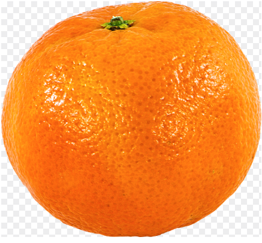
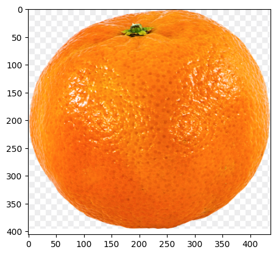
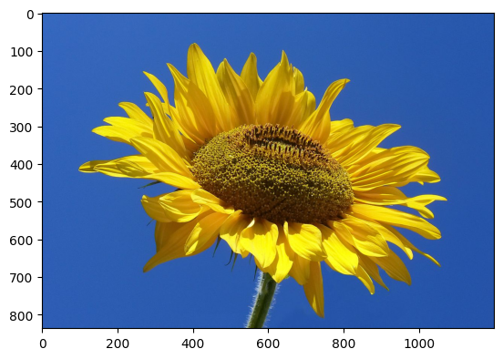
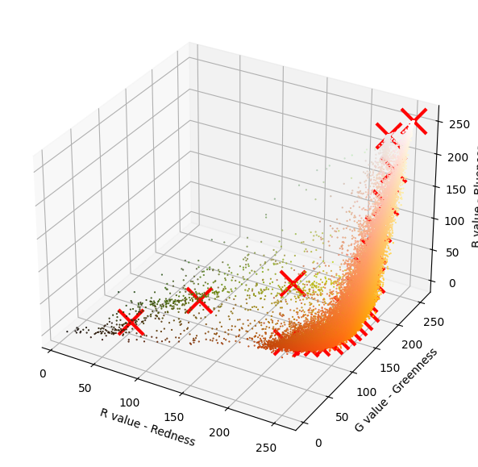
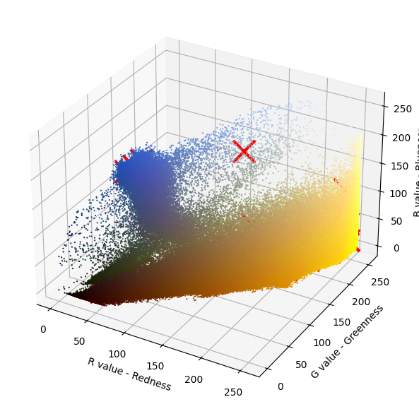
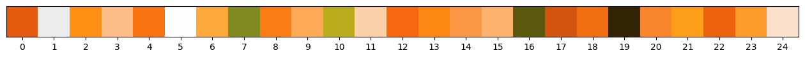
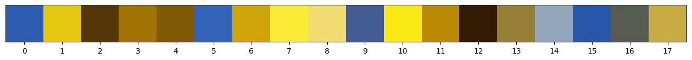
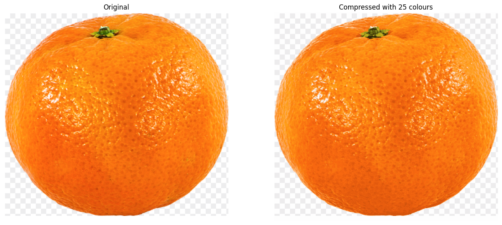
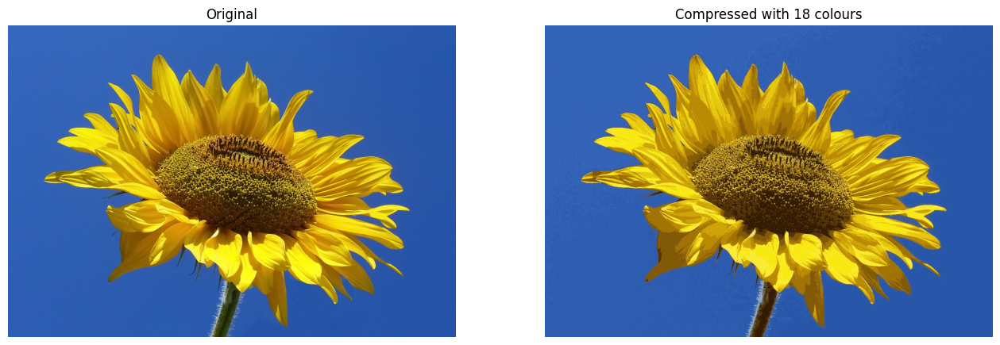

# Image compression with K-means

We use K-Means for image compression:

1. Each pixel in an image is represented using $RGB$ encoding (three values for red, green, and blue, each ranging from $0$ to $255$).
2. The image contains many colors, but you will reduce this to just $n$ colors.
3. This compression works by:
   - Storing the $RGB$ values of the $n$ colors.
   - Storing an index ($4$ bits) for each pixel to indicate which color it uses.

Using `K-Means`, we group pixels into $n$ clusters based on their $RGB$ values and replace the original pixels with the closest cluster color to compress the image.

    
    

 

#### **Visualize image**

As We can see, this creates a three-dimensional matrix `original_img` where

- the first two indices identify a pixel position, and
- the third index represents $red$, $green$, or $blue$.

For example, `original_img[50, 33, 2]` gives the blue intensity of the pixel at row $50$ and column $33$. 
The value you get from `original_img[50, 33, 2]` will be a number between $0$ (no blue) and $255$ (maximum blue)

    
    

 

#### **Processing data**

This reshaped matrix `(X_img)` is ready to be used as input for the K-Means clustering algorithm, which can group pixels based on their color similarities.

**1. Image Preparation:**

- It ensures the image is in the correct $RGB$ format.
- If the image has extra channels (like transparency), it removes them, keeping only the $red$, $green$, and $blue$ channels.

**2. Count Pixels:**

- The total number of pixels `(m)` is calculated by multiplying the number of rows and columns in the image.

**3. Reshape the Image:**

- The image data, which is originally in a $3D$ format `(rows, columns, RGB)`, is reshaped into a $2D$ matrix:
  - Each row in the matrix represents one pixel.
  - Each row has $3$ values: $red$, $green$, and $blue$ intensities for that pixel.

_Note: If you'll try this exercise later on a JPG file, you first need to divide the pixel values by 255 so it will be in the range 0 to 1._

 

#### **K-Means on image pixels**

The code creates a $3D$ plot showing all the colors in the original image, with each pixel represented by its $R (red), G (green), and  B (blue)$ values.

- Dots: Each dot corresponds to a pixel's color (thousands of clolors) in the original image.
- Red Markers: These represent the centroids after running K-means clustering, which are the $K$ main colors chosen to compress the image.

    
    

 

You can visualize the colors at each of the red markers $(i.e. centroids)$ above with the function below.  
You will only see these colors when you generate the new image in the next section. The number below each color is its $index$ and these are the numbers you see in the `idx` array.

 

    
    

 

#### **Compress the image**

Instead of storing the exact $RGB$ value for every pixel, the algorithm finds $K$ main colors $(centroids)$ that best represent the image.
These $K$ colors act like a $"palette"$ for the image. 
After identifying the $K$ colors, each pixel is assigned to the closest color in the palette.
 

For $K=16$ and $128px \times 128px$ image:

**_Original Image Storage_**

- Each channel is stored using `8 bits` (a value between $0$ and $255$).
- Every pixel requires `24 bits` ($8$ bits × $3$ channels).
- Total number of pixels = $( 128 \times 128 = 16,384 $).
- Total bits required = $( 16,384 \times 24 = 393,216 $) bits.

**_Compressed Image Storage_**

- To store this assignment, we only need `4 bits per pixel` because $( 2^4 = 16 )$, which is enough to reference one of the 16 colors.
- The 16 colors (palette) require `24 bits per color`. Total = $( 16 \times 24 = 384 )$ bits.
- Assigning each pixel to a color requires `4 bits per pixel`. Total = $( 16,384 \times 4 = 65,536 $) bits.
- Final total storage = $( 384 + 65,536 = 65,920 $) bits.
- Compression achieved = $( 393,216 / 65,920 \approx 6 $).
   

`Finally`, we can view the effects of the compression by reconstructing
the image based only on the centroid assignments.

- Specifically, we replaced each pixel with the value of the centroid assigned to it.
- Figure shows a sample reconstruction. Even though the resulting image retains most of the characteristics of the original, we can also see some `compression artifacts` because of the fewer colors used.

    
    

